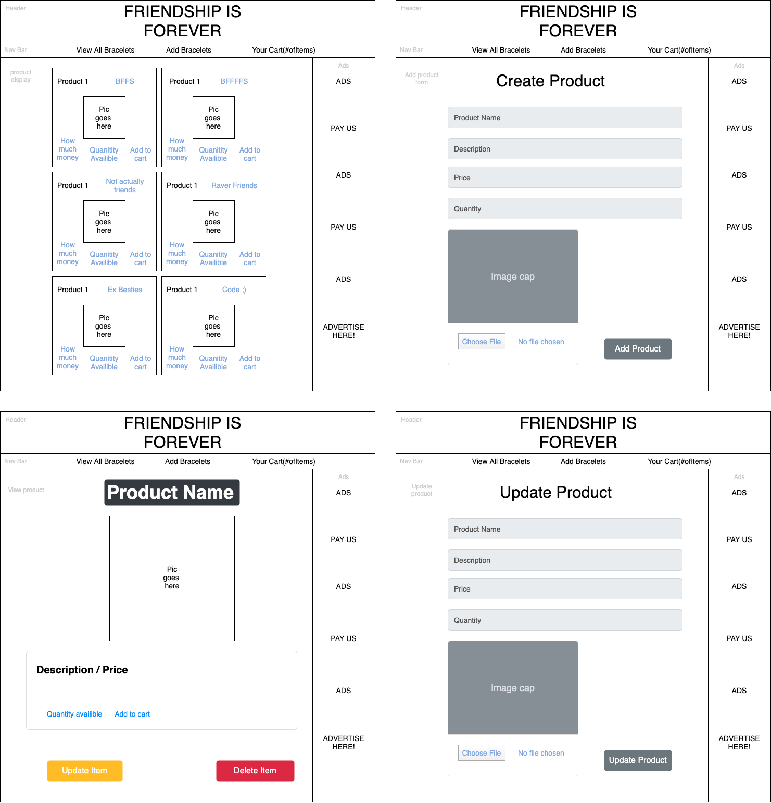

# Friend-Ship is Forever!

#### This is a merch site that sells friendship bracelets

#### Chynna Lew & Diego Serafico

## Technologies Used

* React
* JavaScript
* Node Package Manager
* Webpack
* ESLint

## Description
This is a practice project for Epicodus that contains full CRUD functionality for a merch site.

## Diagram

## Setup/Installation Requirements

* Download or clone [this](https://github.com/chynnalew/friend-ship) repository to your local machine
* Open the terminal and run the command '$ npm install' to install the needed plugins and packages
* Open the application by running the command '$ npm run start' in the terminal.

## Known Bugs

* No known bugs

## License
MIT[https://opensource.org/licenses/MIT] 2021

## Contact Information
